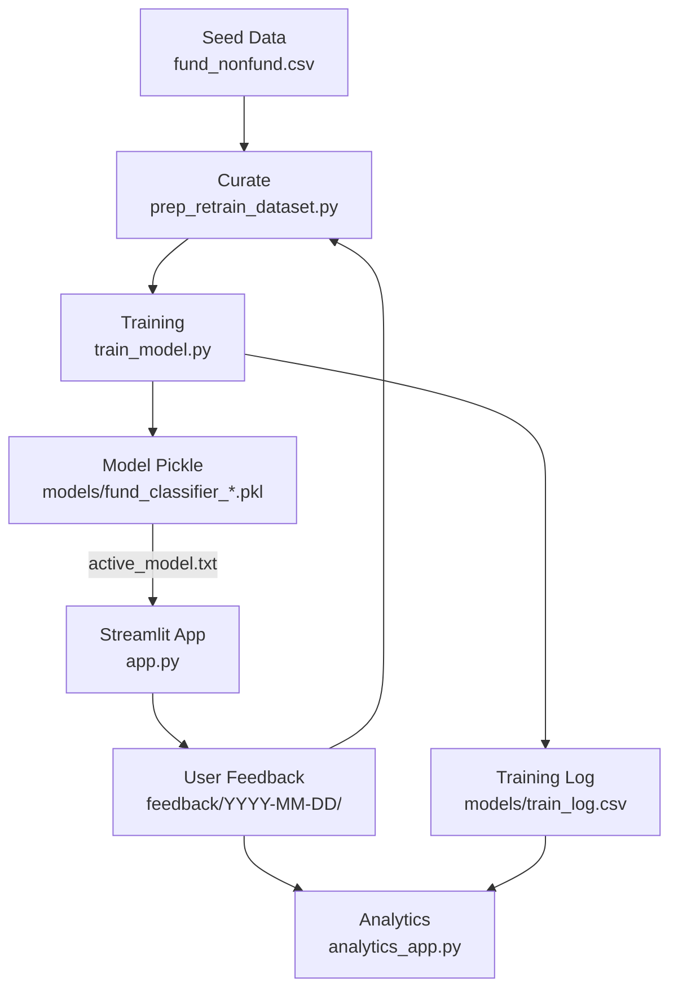

---

# Fund Classification ML System

This is a **mock ML system** that classifies whether a given name is a **Fund** or **Non-Fund**.

The goal is not production-grade accuracy but to demonstrate a realistic workflow:

* Generating **synthetic seed data**
* Training a simple **scikit-learn model**
* Serving predictions via a **Streamlit app**
* Collecting **human feedback** on predictions
* Periodically **curating + retraining** using both seed and feedback data
* Analyzing **feedback quality and model metrics** with a dashboard

---

## Features

* **Synthetic seed data** generator (`make_data.py`)
* **Streamlit app** (`app.py`) where users:

  * Enter their username
  * Paste multiple names
  * Get Fund/Non-Fund predictions
  * Correct labels inline and submit feedback
* **Feedback logging** → saved in structured CSVs by date and user
* **Dataset curation** (`prep_retrain_dataset.py`):

  * Combines seed data + feedback
  * Applies majority vote if multiple users labeled the same name
  * Tags each row with `source` (`seed` vs `feedback`) and `timestamp`
* **Training & logging** (`train_model.py`):

  * Fits model from scratch on curated dataset
  * Saves model pickle with timestamp
  * Logs metrics (accuracy, precision/recall per class) into `models/train_log.csv`
  * Optionally promotes a new model for the app
* **Analytics dashboard** (`analytics_app.py`):

  * **Feedback analytics**: disagreement rate, per-user stats, per-version stats, class balance, hot tokens
  * **Training analytics**: model accuracy over time, latest runs table

---

## Project Structure

```
fund-classifier/
├─ app.py                       # Streamlit app for batch prediction + feedback
├─ make_data.py                 # Generate synthetic seed dataset
├─ prep_retrain_dataset.py      # Curate seed + feedback → training dataset
├─ train_model.py               # Train model, log metrics, save pickle
├─ analytics_app.py             # Streamlit dashboard for feedback + training analytics
├─ requirements.txt
│
├─ data/
│  ├─ seed/
│  │  └─ fund_nonfund.csv       # synthetic seed data
│  └─ curated/
│     └─ training_dataset.csv   # curated dataset (seed + feedback majority vote)
│
├─ feedback/
│  └─ YYYY-MM-DD/
│     └─ labels_YYYYMMDDTHHMMSSZ_user=<username>_batch=<uuid8>.csv
│
└─ models/
   ├─ active_model.txt          # holds the model filename used by app
   ├─ fund_classifier_YYYYMMDD_HHMMSS.pkl
   ├─ train_log.csv             # log of all retrains (CSV)
   └─ train_log.xlsx            # optional Excel export
```

---

## Quickstart

### 0. Setup

```bash
python -m venv .venv
# Windows: .venv\Scripts\activate
# macOS/Linux:
source .venv/bin/activate
pip install -r requirements.txt
```

### 1. Generate seed data

```bash
python make_data.py
```

### 2. Create initial curated dataset

```bash
python prep_retrain_dataset.py
```

### 3. Train & log metrics

```bash
# Train, log metrics, save model pickle
python train_model.py

# Or: train and promote immediately as the active model
python train_model.py --promote
```

### 4. Run the Streamlit app

```bash
streamlit run app.py
```

* Enter your username
* Paste multiple names (one per line)
* Predictions appear in a table → correct labels inline
* Submit → feedback saved under `feedback/YYYY-MM-DD/`

### 5. Weekly retrain loop

```bash
# Open the dashboard to explore disagreement & training metrics
streamlit run analytics_app.py

# Curate dataset (seed + feedback)
python prep_retrain_dataset.py

# Train & log again
python train_model.py
```

### 6. Switch the active model

```bash
# Option A: promote during training
python train_model.py --promote

# Option B: manually edit models/active_model.txt
#   e.g. fund_classifier_20250816_221030.pkl
```

---

## Weekly Workflow Diagram



---

## Example Inputs

```
Arcadia Global Equity Fund
BluePeak Strategic Bond ETF
Evergreen Value Trust
Acme Inc.
Bank of America checking account
Olivia Nguyen
Tesla Inc. – Careers
NorthBridge Momentum Fund
Sierra Income UCITS
Wire Transfer Receipt
```

---

